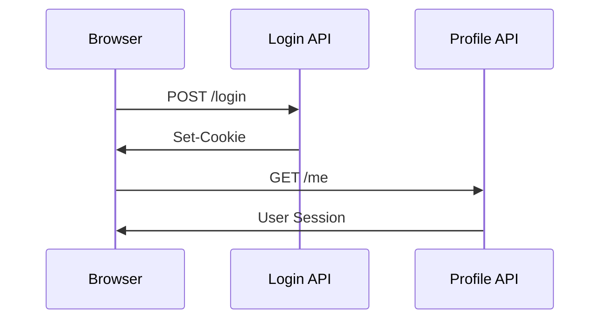

# AuthLens

AuthLens is a developer tool for inspecting, visualizing, and documenting
authentication flows in **authorized** web applications. You sign in normally,
AuthLens observes — and produces a readable report (Markdown / JSON / Mermaid
diagram) of what actually happened.

---

## Overview

Modern web applications often use complex authentication flows involving:

- Session Cookies
- CSRF Tokens
- JWT Access Tokens
- OAuth Redirects
- SSO Providers
- Multi-step Login Flows

Understanding these flows in legacy or undocumented systems can be
time-consuming. AuthLens helps developers and QA engineers observe, analyze,
and document authentication behavior through an interactive visual workflow.

---

## Features

| | |
|---|---|
| **Auth flow detection** | Login request scoring, CSRF/OAuth/OIDC/SSO indicators, JWT detection |
| **Snapshots & diffs** | Cookie diff (added/changed/removed, HttpOnly/Secure/SameSite), localStorage / sessionStorage diff |
| **Visualization** | Auto-generated Mermaid sequence diagram, rendered inline in the app |
| **JWT inspection** | Decoded header / payload / expiry status for every JWT found in cookies, headers, storage, or response bodies |
| **Report export** | Markdown (with diagram), JSON, curl & fetch snippets |
| **Compact mode** | Filter timeline & request list to auth-relevant events only |
| **i18n** | English & Korean UI (auto-detected, switchable in Settings) |

---

## Example flow



---

## Requirements

| Component | Minimum | Used for |
|---|---|---|
| Node.js | **18+** (20+ recommended) | UI build, sidecar, tests |
| npm | 9+ | dependency management |
| Rust toolchain | stable | desktop (Tauri) build only |
| Playwright Chromium | downloaded via `npx playwright install chromium` | real capture mode |
| OS | macOS / Linux / Windows | desktop builds |

> **Tauri prerequisites** (Rust + webview deps) — see
> [`tauri.app/v1/guides/getting-started/prerequisites`](https://tauri.app/v1/guides/getting-started/prerequisites).

---

## Getting started

```sh
git clone <repo>
cd authlens
npm install
npx playwright install chromium     # required for real capture
```

### Run as a desktop app (real capture)

```sh
npm run tauri:dev
```

A separate Chromium window opens when you click **Start Capture**. Sign in
normally — AuthLens records the network traffic from the Rust backend via a
Node sidecar that drives Playwright. Click **Stop Capture** to analyze.

### Run as a browser preview (UI only, simulated capture)

```sh
npm run dev          # http://localhost:5173
```

Useful for working on the UI. The Capture screen runs a small *simulated*
network feed because the Playwright backend is only available inside the Tauri
shell.

### Tests / lint / build

```sh
npm run lint
npm test
npm run build         # tsc --noEmit + vite build
```

---

## How capture works

1. You enter a target URL in AuthLens.
2. (Desktop build) AuthLens spawns a Playwright Chromium browser as a
   separate window via a Node sidecar (`sidecar/recorder.mjs`).
3. You complete the login flow manually in that window. **AuthLens never
   automates the login.**
4. The sidecar streams every request, response header, response body preview,
   cookie change, and storage change back to the React UI as NDJSON over
   stdout → Tauri events.
5. You click **Stop Capture**. AuthLens runs the analyzer pipeline:
   - Login request scoring (URL keyword, method, body shape, follow-up calls)
   - Auth type inference (Cookie session / JWT / OAuth / OIDC / SSO)
   - Cookie & storage diff
   - JWT decoding (header / payload / expiry)
   - Mermaid sequence diagram generation
6. The Analysis tab shows the diagram + summary cards + collapsible details.
7. The Report tab renders the Markdown documentation and lets you export
   (`.md` / `.json`).

---

## Safety & client-side constraints

AuthLens is conservative by design — see [`SECURITY.md`](./SECURITY.md) for
the full policy.

### What AuthLens never does

- Automated login, brute force, credential stuffing
- CAPTCHA bypass, fingerprint bypass, MFA bypass
- Session hijacking, mass account login automation
- Vulnerability-exploit payload execution
- Unauthorized service scanning

### Sensitive value handling

- **Raw tokens / passwords / cookies are never persisted to local storage.**
  They live in session memory while the app is open and are stripped
  (`stripRaw`) before any save to SQLite or the in-memory store. The Recent
  Sessions list never holds raw secrets.
- The UI shows **masked values by default**. The Settings toggle
  "Reveal raw values by default" only controls whether the Report screen's
  rendered preview shows raw — it does *not* change persistence.
- Markdown / JSON / curl / fetch exports are **masked by default**. A
  per-export "Include raw values" checkbox surfaces a visible warning when on.
- Replay sandbox and raw export are **off by default** and must be enabled
  per session.

### Capture limits

- Response body preview is capped (default 8 KB, configurable in Settings).
- Binary response bodies (image, video, font, application/octet-stream, …)
  are excluded from capture.
- Sidecar finalization steps have timeouts so a wedged or closed browser
  cannot block analysis.

### Sidecar environment

The Playwright sidecar (`sidecar/recorder.mjs`) requires a system Node
runtime; it is not bundled. In production builds it is shipped as a Tauri
resource (`tauri.bundle.resources`) but Node + the Playwright module from
`node_modules` are expected on the user's machine.

---

## Architecture (short)

```text
src/
  core/        types, masking policy, JWT decoder, constants
  recorder/    Playwright adapter + in-memory recorder
  analyzer/    scoring, diff, auth-type inference, noteworthy filter
  reporter/    markdown / mermaid / JSON / curl / fetch generators
  storage/     SessionStore (in-memory + SQLite) — strips raw on save
  ui/          React UI: Home / Capture / Analysis / Report / Settings
sidecar/       Node Playwright sidecar (NDJSON streaming)
src-tauri/     Rust shell: spawns sidecar, forwards events
```

Tests live alongside source under `tests/`.

---

## Intended use

AuthLens is intended for:

- authorized security testing
- internal API debugging
- authentication flow visualization
- QA and development workflows
- legacy system analysis

Unauthorized use against third-party services may violate laws or terms of
service.

---

## Tech stack

- **Tauri** (Rust shell, native window, sidecar IPC)
- **React 18** + **TypeScript** (UI)
- **Vite** (dev server + bundler)
- **Playwright** (headful Chromium capture, via Node sidecar)
- **SQLite** (`better-sqlite3`) — local capture history (raw values stripped
  before save)
- **react-i18next** (English / Korean)
- **marked** + **mermaid** (Report preview)

---

## Philosophy

AuthLens is **not** a penetration testing tool. The goal is to improve:

- developer experience
- authentication observability
- internal documentation
- QA productivity
- system understanding

The tool focuses on observation and documentation. Anything that would
require attacking or impersonating a system is explicitly out of scope.

---

## License

Apache License 2.0 — see [LICENSE](./LICENSE).
