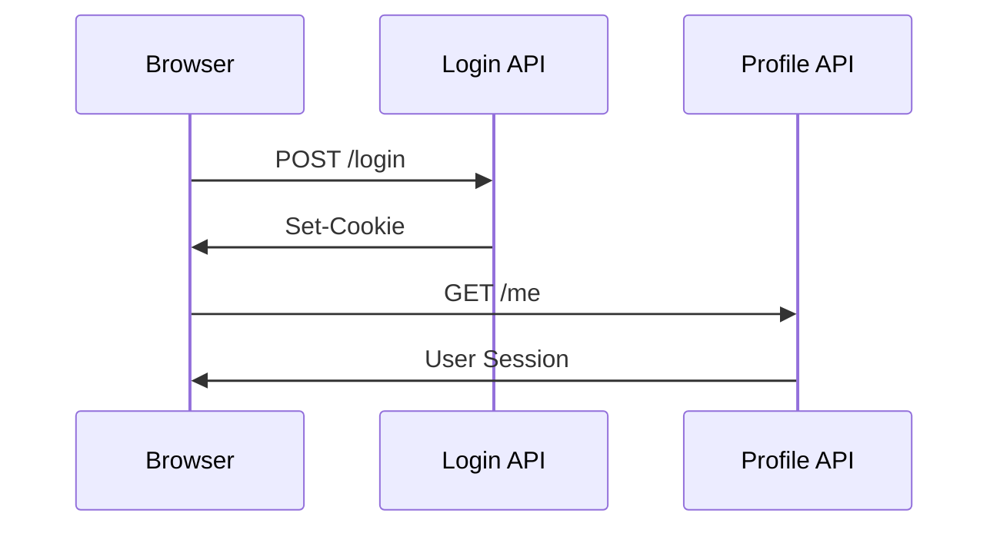

# AuthLens

AuthLens is a developer tool for inspecting, visualizing, and documenting authentication flows in authorized web applications.

## Overview

Modern web applications often use complex authentication flows involving:

- Session Cookies
- CSRF Tokens
- JWT Access Tokens
- OAuth Redirects
- SSO Providers
- Multi-step Login Flows

Understanding these flows in legacy or undocumented systems can be time-consuming and difficult.

AuthLens helps developers and QA engineers observe, analyze, and document authentication behavior through an interactive visual workflow.

---

## Features

### Authentication Flow Detection

- Detect login-related network requests
- Identify authentication endpoints
- Track redirects and session establishment
- Observe token and cookie changes

### Flow Visualization

- Visualize authentication sequences
- Generate Mermaid diagrams automatically
- Understand session transitions

### API Documentation Support

- Generate Markdown reports
- Export request/response summaries
- Produce curl and fetch examples

### Developer Friendly

- Embedded browser workflow
- No packet-level expertise required
- Focused on observability and documentation

---

## Example Flow

---

## Intended Use

AuthLens is intended for:

- authorized security testing
- internal API debugging
- authentication flow visualization
- QA and development workflows
- legacy system analysis

Unauthorized use against third-party services may violate laws or terms of service.

---

## Planned Features

- [ ] Login request auto-detection
- [ ] CSRF token analysis
- [ ] Cookie/session diff viewer
- [ ] OAuth/OIDC flow analysis
- [ ] Mermaid diagram export
- [ ] Markdown/OpenAPI export
- [ ] curl/fetch code generation
- [ ] Replay sandbox mode
- [ ] AI-assisted auth flow summarization

---

## Tech Stack

- Tauri
- React
- TypeScript
- Playwright
- SQLite

---

## Philosophy

AuthLens is not a penetration testing tool.

The goal of AuthLens is to improve:

- developer experience
- authentication observability
- internal documentation
- QA productivity
- system understanding

---

## License

Apache License 2.0

See [LICENSE](./LICENSE) for details.

---
