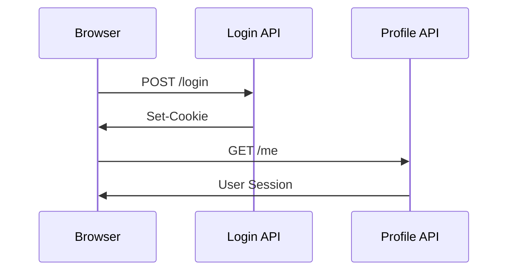

# AuthLens

> A developer tool for inspecting, visualizing, and documenting authentication
> flows in **authorized** web applications. You sign in normally — AuthLens
> observes — and produces a readable report (Markdown / JSON / Mermaid /
> Postman) of what actually happened.

AuthLens is **not** a penetration testing tool. It focuses on observation and
documentation; anything that would require attacking or impersonating a system
is explicitly out of scope.

---

## Why

Modern web apps stitch together session cookies, CSRF tokens, JWTs, OAuth
redirects, SSO providers, and multi-step login flows. Understanding these in
legacy or undocumented systems is slow. AuthLens lets developers and QA
engineers capture a real session and get a structured, readable picture of
what the auth layer is actually doing.

---

## Features

| | |
|---|---|
| **Auth flow detection** | Login request scoring, CSRF/OAuth/OIDC/SSO indicators, JWT detection, Basic-auth detection |
| **Snapshots & diffs** | Cookie diff (added/changed/removed + HttpOnly/Secure/SameSite), localStorage / sessionStorage diff |
| **Visualization** | Auto-generated Mermaid sequence diagram, rendered inline |
| **JWT inspection** | Decoded header / payload / expiry status for every JWT found in cookies, headers, storage, or response bodies |
| **Discovered endpoints** | Path-pattern grouping (e.g. `/users/:id`), per-method × per-status counts, copy as curl |
| **Report exports** | Markdown (with diagram), JSON, Postman v2.1 collection, curl & fetch snippets |
| **Replay sandbox** | Re-issue captured requests in dry-run or live mode with strict per-session quotas (off by default) |
| **Compact mode** | Filter timeline & request list to auth-relevant events only |
| **i18n** | English & Korean UI (auto-detected, switchable in Settings) |

### Example diagram



---

## Quick start

```sh
git clone <repo>
cd authlens
npm install
npx playwright install chromium    # required for real capture
```

### Desktop app (real capture)

```sh
npm run tauri:dev
```

A separate Chromium window opens when you click **Start Capture**. Sign in
normally — AuthLens records network traffic via a Node sidecar that drives
Playwright. Click **Stop Capture** to analyze.

### Browser preview (UI only, simulated capture)

```sh
npm run dev      # http://localhost:5173
```

The Capture screen uses a small simulated network feed; real Playwright
capture is only available inside the Tauri shell.

### Tests / lint / build

```sh
npm run lint
npm test
npm run build    # tsc --noEmit + vite build
```

---

## How capture works

1. Enter a target URL in AuthLens.
2. **(Desktop)** AuthLens spawns a Playwright Chromium browser as a separate
   window via the Node sidecar at `sidecar/recorder.mjs`.
3. You complete the login flow manually in that window. **AuthLens never
   automates the login.**
4. The sidecar streams every request, response header, response body preview,
   cookie change, and storage change back to the React UI as NDJSON over
   stdout → Tauri events.
5. Click **Stop Capture**. The analyzer runs:
   - Login request scoring (URL keyword, method, body shape, follow-up calls)
   - Auth type inference (Cookie session / JWT / OAuth / OIDC / SSO / Basic)
   - Cookie & storage diff
   - JWT decoding (header / payload / expiry)
   - Discovered-endpoint grouping with status-code histogram
   - Mermaid sequence diagram generation
6. **Analysis** tab shows the diagram + summary cards + collapsible details.
7. **Report** tab renders Markdown documentation and exports
   (`.md` / `.json` / Postman collection).

---

## Safety & sensitive value handling

AuthLens is conservative by design — see [`SECURITY.md`](./SECURITY.md) for
the full policy.

### What AuthLens never does

- Automated login, brute force, credential stuffing
- CAPTCHA / fingerprint / MFA bypass
- Session hijacking, mass account login automation
- Vulnerability-exploit payload execution
- Unauthorized service scanning

### Raw values

- **Raw tokens / passwords / cookies are never persisted to disk.** They live
  in session memory while the app is open and are stripped (`stripRaw`)
  before any save to SQLite or the in-memory store. The Recent Sessions list
  never holds raw secrets.
- The UI shows **masked values by default**. The Settings toggle "Reveal raw
  values by default" only controls the Report preview's rendering — it does
  *not* change persistence.
- Markdown / JSON / curl / fetch / Postman exports are **masked by default**.
  A per-export "Include raw values" checkbox shows a visible warning when on.
- Replay sandbox and raw export are **off by default** and must be enabled
  per session.

### Replay sandbox limits

- 1.5 s cooldown between sends
- 10 sends per capture session (hard cap)
- Max 5 redirects, max 256 KB response body
- HTTP/HTTPS only (no file://, no custom schemes)
- Per-host authorization checkbox required for live mode

### Capture limits

- Response body preview is capped (default 8 KB, configurable in Settings).
- Binary response bodies (image, video, font, application/octet-stream, …)
  are excluded.
- Sidecar finalization steps have timeouts so a wedged or closed browser
  cannot block analysis.

---

## Architecture

```text
src/
  core/             types, masking policy, JWT decoder, constants
  recorder/         Playwright adapter + in-memory recorder
  analyzer/         pipeline entry + 3 cohesive groups (see below)
  reporter/         markdown / mermaid / JSON / curl / fetch / Postman generators
  storage/          SessionStore (in-memory + SQLite) — strips raw on save
  ui/               React UI: Home / Capture / Analysis / Report / Settings
sidecar/            Node Playwright sidecar (NDJSON streaming over stdout)
src-tauri/          Rust shell: spawns sidecar, forwards events, replay sandbox
tests/              Vitest suites — mirrors src/ layout
```

Every top-level module exposes a barrel `index.ts`; callers import from
`@/analyzer`, `@/core`, etc. and never reach into individual files. The UI
entry point is `src/ui/main.tsx` (Vite convention).

### Inside `src/analyzer/`

```text
analyzer/
  index.ts                # public barrel — re-exports the groups below
  analyze.ts              # pipeline entry
  events.ts               # shared event/step types

  login/                  # login detection
    scoring.ts            # request scoring
    form.ts               # HTML <form> parsing
    credentials.ts        # Basic/Bearer credential extraction
    logout.ts

  auth-type/              # auth scheme inference
    detect.ts             # cookie-session / JWT / OAuth / OIDC / SSO / Basic
    headers.ts            # Authorization header parsing
    oauth.ts              # OAuth/OIDC flow recognition
    jwt-locations.ts      # find JWTs across cookies / headers / storage / bodies

  artifacts/              # captured artifacts & secondary outputs
    diff.ts               # cookie + storage diff
    discovered-endpoints.ts
    redirects.ts
    noteworthy.ts         # filter noisy events
    raw-presence.ts
```

### Performance notes

Live request/response events from the sidecar are batched per animation
frame before they touch React state, so a chatty target site can't starve
click handling on the Stop button. The live request table is also capped
at 1000 rows (counters keep the true total).

---

## Requirements

| Component | Minimum | Used for |
|---|---|---|
| Node.js | **18+** (20+ recommended) | UI build, sidecar, tests |
| npm | 9+ | dependency management |
| Rust toolchain | stable | desktop (Tauri) build only |
| Playwright Chromium | `npx playwright install chromium` | real capture mode |
| OS | macOS / Linux / Windows | desktop builds |

> **Tauri prerequisites** (Rust + webview deps) — see
> [tauri.app/v1/guides/getting-started/prerequisites](https://tauri.app/v1/guides/getting-started/prerequisites).

### Sidecar runtime

The Playwright sidecar (`sidecar/recorder.mjs`) needs a system Node runtime;
it is not bundled. In production builds it ships as a Tauri resource
(`tauri.bundle.resources`) but Node + Playwright from `node_modules` are
expected on the user's machine.

---

## Tech stack

- **Tauri** (Rust shell, native window, sidecar IPC, replay sandbox)
- **React 18** + **TypeScript** + **Vite** (UI)
- **Playwright** (headful Chromium capture, via Node sidecar)
- **SQLite** (`better-sqlite3`) — local capture history (raw values stripped
  before save)
- **react-i18next** (English / Korean, parity-checked)
- **marked** + **mermaid** (Report preview)

---

## Intended use

- Authorized security testing
- Internal API debugging
- Authentication flow visualization
- QA and development workflows
- Legacy system analysis

Unauthorized use against third-party services may violate laws or terms of
service.

---

## License

Apache License 2.0 — see [LICENSE](./LICENSE).
