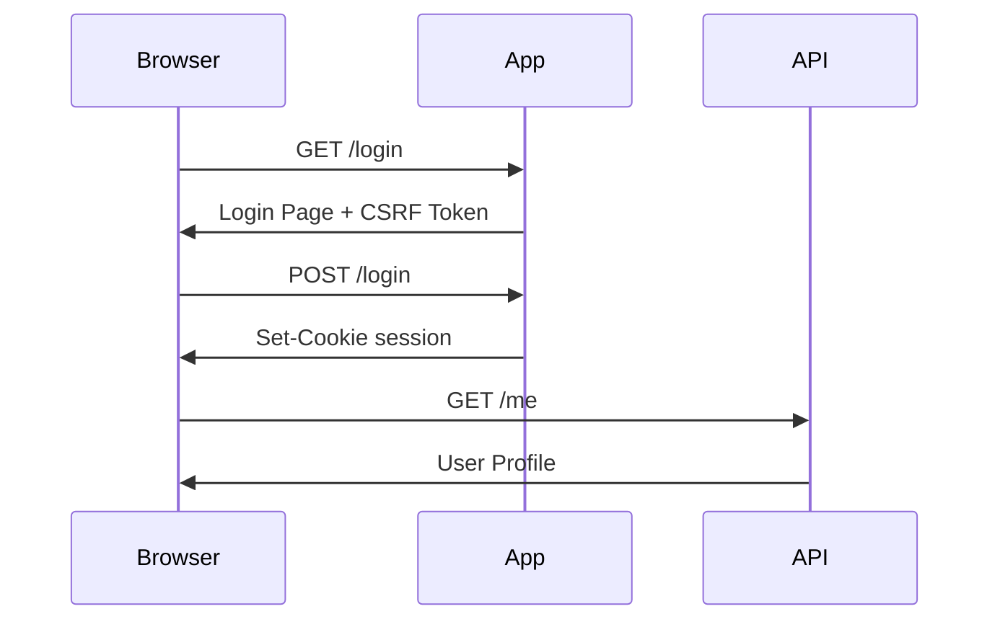

# AuthLens 기능 구현 체크리스트

AuthLens는 허가된 웹 애플리케이션의 인증 흐름을 관찰, 분석, 시각화, 문서화하는 개발자 도구입니다.

이 문서는 실제 구현 순서를 기준으로 작성되었습니다.

---

## 0. 프로젝트 기본 원칙

- [ ] 허가된 시스템 분석만 지원한다는 문구를 README와 앱 첫 실행 화면에 표시
- [ ] 비밀번호, 토큰, 쿠키는 기본적으로 저장하지 않음
- [ ] 민감 정보는 UI에서 기본 마스킹 처리
- [ ] Replay, export, token copy 기능은 기본 비활성
- [ ] 사용자가 직접 로그인하고, 도구는 흐름만 관찰하는 구조로 설계
- [ ] 공격 자동화 기능은 포함하지 않음
  - [ ] CAPTCHA 우회 없음
  - [ ] brute force 없음
  - [ ] credential stuffing 없음
  - [ ] session hijacking 목적 기능 없음

---

## 1. MVP 목표

MVP의 목표는 사용자가 직접 로그인한 흐름을 캡처하고, 인증 관련 요청을 요약해서 Markdown 문서로 저장하는 것입니다.

### MVP 사용자 흐름

- [ ] 사용자가 분석할 URL 입력
- [ ] 내장 브라우저 또는 Playwright 브라우저 실행
- [ ] 사용자가 직접 로그인 수행
- [ ] 네트워크 요청/응답 캡처
- [ ] 로그인 관련 요청 후보 자동 탐지
- [ ] 쿠키/스토리지 변화 감지
- [ ] 인증 흐름 요약 화면 제공
- [ ] Markdown 리포트 export

---

## 2. 프로젝트 초기 세팅

### Repository

- [ ] GitHub repository 생성
  - [ ] 이름: `authlens`
  - [ ] 설명: `Visualize and document authentication flows for authorized web applications`
- [ ] Apache License 2.0 추가
- [ ] README.md 작성
- [ ] CONTRIBUTING.md 작성
- [ ] SECURITY.md 작성
- [ ] CODE_OF_CONDUCT.md 작성
- [ ] `.gitignore` 추가
- [ ] issue template 추가
- [ ] pull request template 추가

### App Stack

- [ ] Tauri 프로젝트 생성
- [ ] React 설정
- [ ] TypeScript 설정
- [ ] Vite 설정
- [ ] ESLint 설정
- [ ] Prettier 설정
- [ ] 기본 UI 레이아웃 구성
- [ ] 앱 이름을 AuthLens로 설정

### Directory Structure

- [ ] 기본 디렉터리 구조 생성

```text
authlens/
  apps/
    desktop/
  packages/
    core/
    analyzer/
    recorder/
    reporter/
    ui/
  docs/
  examples/
```

---

## 3. Core Domain 모델 설계

### Authentication Flow Model

- [ ] `AuthFlow` 타입 정의
- [ ] `AuthStep` 타입 정의
- [ ] `NetworkRequest` 타입 정의
- [ ] `NetworkResponse` 타입 정의
- [ ] `CookieSnapshot` 타입 정의
- [ ] `StorageSnapshot` 타입 정의
- [ ] `RedirectStep` 타입 정의
- [ ] `SensitiveValue` 타입 정의

### 예시 타입

```ts
export type AuthFlow = {
  id: string;
  targetUrl: string;
  startedAt: string;
  endedAt?: string;
  steps: AuthStep[];
  cookiesBefore: CookieSnapshot[];
  cookiesAfter: CookieSnapshot[];
  storageBefore: StorageSnapshot;
  storageAfter: StorageSnapshot;
  summary?: AuthFlowSummary;
};
```

---

## 4. 브라우저 실행 기능

### Browser Session

- [ ] URL 입력 UI 구현
- [ ] 분석 시작 버튼 구현
- [ ] Playwright browser context 생성
- [ ] 새 page 생성
- [ ] 사용자가 입력한 URL로 이동
- [ ] 브라우저 종료 기능 구현
- [ ] 분석 중 상태 표시
- [ ] 분석 종료 버튼 구현

### Browser Options

- [ ] headful 모드 지원
- [ ] viewport 크기 설정
- [ ] user-agent 기본값 설정
- [ ] incognito context 사용
- [ ] 세션 격리
- [ ] 분석 종료 시 context 정리

---

## 5. Network Recorder

### Request Capture

- [ ] `page.on("request")` 이벤트 연결
- [ ] request URL 저장
- [ ] method 저장
- [ ] headers 저장
- [ ] postData 저장
- [ ] resourceType 저장
- [ ] timestamp 저장
- [ ] frame URL 저장

### Response Capture

- [ ] `page.on("response")` 이벤트 연결
- [ ] response URL 저장
- [ ] status code 저장
- [ ] status text 저장
- [ ] response headers 저장
- [ ] content-type 저장
- [ ] response body 일부 저장
- [ ] response body 크기 제한
- [ ] binary response 저장 제외

### Redirect Capture

- [ ] redirect chain 추적
- [ ] 301/302/303/307/308 응답 탐지
- [ ] OAuth redirect 후보 탐지
- [ ] SSO redirect 후보 탐지

---

## 6. Cookie / Storage Snapshot

### Cookie

- [ ] 로그인 전 cookie snapshot 저장
- [ ] 로그인 후 cookie snapshot 저장
- [ ] 새로 추가된 cookie 표시
- [ ] 변경된 cookie 표시
- [ ] 삭제된 cookie 표시
- [ ] HttpOnly 여부 표시
- [ ] Secure 여부 표시
- [ ] SameSite 여부 표시
- [ ] Expires / Max-Age 표시

### LocalStorage

- [ ] 로그인 전 localStorage snapshot 저장
- [ ] 로그인 후 localStorage snapshot 저장
- [ ] 추가된 key 표시
- [ ] 변경된 key 표시
- [ ] 삭제된 key 표시
- [ ] token 후보 key 탐지

### SessionStorage

- [ ] 로그인 전 sessionStorage snapshot 저장
- [ ] 로그인 후 sessionStorage snapshot 저장
- [ ] 추가된 key 표시
- [ ] 변경된 key 표시
- [ ] 삭제된 key 표시
- [ ] token 후보 key 탐지

---

## 7. 민감 정보 마스킹

### 기본 마스킹 대상

- [ ] password
- [ ] passwd
- [ ] pwd
- [ ] token
- [ ] access_token
- [ ] refresh_token
- [ ] id_token
- [ ] authorization
- [ ] cookie
- [ ] set-cookie
- [ ] session
- [ ] csrf
- [ ] xsrf

### Masking Policy

- [ ] UI에서는 기본 마스킹
- [ ] export에서도 기본 마스킹
- [ ] 사용자가 명시적으로 해제하지 않으면 원문 저장 금지
- [ ] 마스킹 해제 시 경고 표시
- [ ] 마스킹된 값은 앞 4글자 정도만 표시
- [ ] 원문은 메모리에서만 임시 사용
- [ ] 로그 파일에 민감 정보 기록 금지

---

## 8. 로그인 요청 후보 탐지

### Scoring Rule

- [ ] URL에 `login` 포함 시 점수 증가
- [ ] URL에 `signin` 포함 시 점수 증가
- [ ] URL에 `auth` 포함 시 점수 증가
- [ ] URL에 `session` 포함 시 점수 증가
- [ ] URL에 `token` 포함 시 점수 증가
- [ ] method가 POST면 점수 증가
- [ ] request body에 password 계열 필드가 있으면 점수 증가
- [ ] response에 set-cookie가 있으면 점수 증가
- [ ] response에 access token 후보가 있으면 점수 증가
- [ ] 로그인 전후 cookie 변화가 있으면 점수 증가
- [ ] 로그인 후 `/me`, `/profile`, `/user` API 호출이 있으면 점수 증가

### Result

- [ ] 인증 관련 요청 후보 리스트 표시
- [ ] 가장 가능성 높은 요청 표시
- [ ] 점수와 판단 근거 표시
- [ ] 사용자가 수동으로 로그인 요청 지정 가능

---

## 9. 인증 방식 추론

### Cookie Session

- [ ] Set-Cookie 발생 여부 확인
- [ ] HttpOnly session cookie 탐지
- [ ] 이후 요청에 cookie 포함 여부 확인
- [ ] Cookie Session 기반 인증으로 분류

### JWT

- [ ] access_token 후보 탐지
- [ ] JWT 형태 탐지
- [ ] Authorization Bearer header 탐지
- [ ] localStorage/sessionStorage token 저장 여부 확인
- [ ] JWT 기반 인증으로 분류

### CSRF

- [ ] csrf token key 탐지
- [ ] xsrf token key 탐지
- [ ] hidden input token 탐지
- [ ] request header의 X-CSRF-Token 탐지
- [ ] cookie와 header 간 token 매칭 탐지
- [ ] CSRF 보호 사용 여부 표시

### OAuth / OIDC

- [ ] authorization endpoint 후보 탐지
- [ ] redirect_uri 파라미터 탐지
- [ ] response_type 탐지
- [ ] client_id 탐지
- [ ] code 파라미터 탐지
- [ ] state 파라미터 탐지
- [ ] token endpoint 후보 탐지
- [ ] id_token 후보 탐지

### SSO

- [ ] 다른 도메인으로 redirect되는 흐름 탐지
- [ ] SAML 관련 파라미터 탐지
- [ ] SSO provider 후보 도메인 표시
- [ ] 로그인 후 원래 도메인 복귀 여부 확인

---

## 10. Flow Visualization

### Timeline View

- [ ] 요청 시간순 목록 표시
- [ ] 인증 관련 요청 강조
- [ ] redirect 흐름 표시
- [ ] cookie 변경 시점 표시
- [ ] token 저장 시점 표시
- [ ] 로그인 성공 추정 시점 표시

### Mermaid Diagram

- [ ] Mermaid sequence diagram 생성
- [ ] Browser 노드 생성
- [ ] App Server 노드 생성
- [ ] Auth Server 노드 생성
- [ ] API Server 노드 생성
- [ ] redirect 단계 표시
- [ ] set-cookie 단계 표시
- [ ] token exchange 단계 표시
- [ ] `/me` API 확인 단계 표시

### 예시



---

## 11. Report Export

### Markdown Report

- [ ] 분석 대상 URL 표시
- [ ] 분석 시간 표시
- [ ] 인증 방식 요약
- [ ] 로그인 요청 후보 표시
- [ ] 주요 request/response 요약
- [ ] cookie 변화 요약
- [ ] storage 변화 요약
- [ ] redirect 흐름 표시
- [ ] Mermaid diagram 포함
- [ ] 보안 주의사항 포함
- [ ] 민감 정보 마스킹 적용

### JSON Export

- [ ] AuthFlow JSON export
- [ ] 마스킹 적용
- [ ] schema version 포함
- [ ] tool version 포함

### curl / fetch Export

- [ ] curl 예시 생성
- [ ] fetch 예시 생성
- [ ] 기본적으로 민감 정보 제거
- [ ] 사용자가 명시적으로 선택한 요청만 export

---

## 12. UI 화면 구성

### Home

- [ ] 프로젝트 설명 표시
- [ ] URL 입력
- [ ] 분석 시작 버튼
- [ ] 최근 분석 목록
- [ ] 안전 사용 안내 표시

### Capture Screen

- [ ] 현재 URL 표시
- [ ] 요청 수 표시
- [ ] 인증 후보 요청 수 표시
- [ ] 분석 종료 버튼
- [ ] 실시간 요청 목록 표시

### Analysis Screen

- [ ] 인증 방식 요약 카드
- [ ] 로그인 요청 후보 카드
- [ ] cookie 변화 카드
- [ ] storage 변화 카드
- [ ] redirect timeline
- [ ] request detail panel
- [ ] Mermaid preview

### Report Screen

- [ ] Markdown preview
- [ ] JSON preview
- [ ] export 버튼
- [ ] copy 버튼
- [ ] 민감 정보 포함 여부 경고

### Settings

- [ ] masking policy 설정
- [ ] capture body size limit 설정
- [ ] export option 설정
- [ ] browser option 설정
- [ ] experimental feature toggle

---

## 13. 저장소 / Persistence

### Local Database

- [ ] SQLite 연결
- [ ] 분석 세션 저장
- [ ] 분석 결과 저장
- [ ] 최근 분석 목록 저장
- [ ] 사용자가 삭제 가능하게 구현

### Privacy

- [ ] 민감 정보 저장 금지
- [ ] 저장 전 마스킹 적용
- [ ] 전체 분석 기록 삭제 기능
- [ ] 세션별 삭제 기능

---

## 14. 보안 UX

### First Launch Warning

- [ ] 첫 실행 시 authorized use 안내
- [ ] 민감 정보 저장 정책 안내
- [ ] 사용자가 확인해야 다음 화면 진입 가능

### Dangerous Action Warning

- [ ] 원문 token 보기 시 경고
- [ ] cookie export 시 경고
- [ ] replay 기능 사용 시 경고
- [ ] 외부 도메인 분석 시 경고

### Safe Defaults

- [ ] token 원문 미표시
- [ ] password 필드 미저장
- [ ] request body 크기 제한
- [ ] response body 크기 제한
- [ ] binary body 제외
- [ ] export 기본 마스킹

---

## 15. 테스트 계획

### Unit Test

- [ ] URL scoring 테스트
- [ ] request classifier 테스트
- [ ] token detector 테스트
- [ ] cookie diff 테스트
- [ ] storage diff 테스트
- [ ] masking 테스트
- [ ] Mermaid generator 테스트
- [ ] Markdown reporter 테스트

### Integration Test

- [ ] mock login server 구성
- [ ] cookie session login 테스트
- [ ] JWT login 테스트
- [ ] CSRF login 테스트
- [ ] OAuth-like redirect 테스트
- [ ] report export 테스트

### E2E Test

- [ ] 앱 실행 테스트
- [ ] URL 입력 테스트
- [ ] 로그인 흐름 캡처 테스트
- [ ] 분석 결과 표시 테스트
- [ ] Markdown export 테스트

---

## 16. Example Apps

테스트와 데모를 위해 예제 서버를 함께 제공합니다.

- [ ] Cookie Session 예제 앱
- [ ] JWT 예제 앱
- [ ] CSRF 예제 앱
- [ ] OAuth-like Redirect 예제 앱
- [ ] SSO-like Redirect 예제 앱

예상 구조:

```text
examples/
  cookie-session-app/
  jwt-app/
  csrf-app/
  oauth-like-app/
```

---

## 17. v1 기능

MVP 이후 v1에서 완성도를 높입니다.

- [ ] OpenAPI 초안 생성
- [ ] HAR import
- [ ] HAR export
- [ ] 다중 도메인 흐름 그룹핑
- [ ] request 검색
- [ ] request 필터링
- [ ] 인증 이벤트 태깅
- [ ] 사용자가 auth step을 수동 편집
- [ ] Mermaid diagram 수동 편집
- [ ] Markdown template 커스터마이징
- [ ] 프로젝트별 설정 저장

---

## 18. AI Assisted 기능

AI 기능은 선택 기능으로 둡니다.

- [ ] 인증 흐름 자연어 요약
- [ ] 의심되는 인증 방식 설명
- [ ] 문서 초안 생성
- [ ] API endpoint 역할 추론
- [ ] 보안적으로 확인해야 할 포인트 제안
- [ ] 민감 정보가 포함되지 않도록 AI 입력 전 마스킹
- [ ] 로컬 모델 사용 옵션 검토
- [ ] 외부 AI API 사용 시 명시적 동의 받기

---

## 19. 위험 기능 관리

아래 기능은 구현하더라도 기본 비활성 또는 Labs 기능으로 둡니다.

### Replay Sandbox

- [ ] 사용자가 선택한 요청만 replay 가능
- [ ] 기본 비활성
- [ ] 원래 도메인이 아닌 mock endpoint로 replay 지원
- [ ] 민감 정보 제거 후 replay
- [ ] 실제 서비스 대상 자동 반복 호출 금지
- [ ] rate limit 적용

### Token / Cookie Export

- [ ] 기본 비활성
- [ ] 강한 경고 표시
- [ ] authorized system 확인 문구 표시
- [ ] export 로그 남김
- [ ] 마스킹 export를 기본값으로 사용

---

## 20. 문서화

### User Docs

- [ ] 설치 방법
- [ ] 첫 분석 실행 방법
- [ ] Markdown report 생성 방법
- [ ] Mermaid diagram 사용 방법
- [ ] 민감 정보 마스킹 정책 설명
- [ ] 안전 사용 가이드

### Developer Docs

- [ ] architecture.md
- [ ] recorder.md
- [ ] analyzer.md
- [ ] reporter.md
- [ ] masking.md
- [ ] security-model.md
- [ ] plugin-system.md

---

## 21. 릴리즈 준비

### Before First Release

- [ ] README 정리
- [ ] LICENSE 확인
- [ ] SECURITY.md 작성
- [ ] screenshot 추가
- [ ] demo gif 추가
- [ ] example report 추가
- [ ] GitHub Actions CI 설정
- [ ] lint/test 자동화
- [ ] release workflow 설정
- [ ] version `0.1.0` 태그 생성

### Release Checklist

- [ ] macOS 빌드 확인
- [ ] Windows 빌드 확인
- [ ] Linux 빌드 확인
- [ ] installer 생성
- [ ] changelog 작성
- [ ] GitHub Release 작성

---

## 22. 구현 우선순위

### Phase 1: Foundation

- [ ] Tauri + React 앱 생성
- [ ] URL 입력 화면
- [ ] Playwright 브라우저 실행
- [ ] Network request/response capture
- [ ] 기본 request list UI

### Phase 2: Auth Analysis

- [ ] cookie snapshot
- [ ] storage snapshot
- [ ] auth request scoring
- [ ] login request candidate UI
- [ ] auth type inference

### Phase 3: Report

- [ ] Markdown report generator
- [ ] Mermaid diagram generator
- [ ] export 기능
- [ ] masking policy 적용

### Phase 4: Polish

- [ ] SQLite 저장
- [ ] 최근 분석 목록
- [ ] 설정 화면
- [ ] 테스트 코드
- [ ] 예제 앱

### Phase 5: Public Release

- [ ] README 정리
- [ ] 문서화
- [ ] 데모 이미지 추가
- [ ] GitHub Actions
- [ ] v0.1.0 release

---

## 23. 구현하지 않을 기능

프로젝트의 안전한 방향성을 위해 아래 기능은 구현하지 않습니다.

- [ ] credential stuffing
- [ ] password brute force
- [ ] CAPTCHA bypass
- [ ] fingerprint bypass
- [ ] MFA 우회
- [ ] 타인 세션 탈취 자동화
- [ ] 대량 계정 로그인 자동화
- [ ] 취약점 공격 payload 자동 실행
- [ ] 무단 서비스 스캐닝

---

## 24. v0.1.0 완료 기준

아래가 완료되면 v0.1.0으로 릴리즈할 수 있습니다.

- [ ] 사용자가 URL을 입력할 수 있다
- [ ] 브라우저에서 직접 로그인할 수 있다
- [ ] 요청/응답을 캡처할 수 있다
- [ ] 로그인 요청 후보를 탐지할 수 있다
- [ ] cookie 변경을 보여줄 수 있다
- [ ] localStorage/sessionStorage 변경을 보여줄 수 있다
- [ ] 인증 방식 요약을 보여줄 수 있다
- [ ] Mermaid sequence diagram을 생성할 수 있다
- [ ] Markdown report를 export할 수 있다
- [ ] 민감 정보가 기본 마스킹된다
- [ ] README에 intended use가 명시되어 있다
- [ ] Apache 2.0 라이선스가 포함되어 있다
